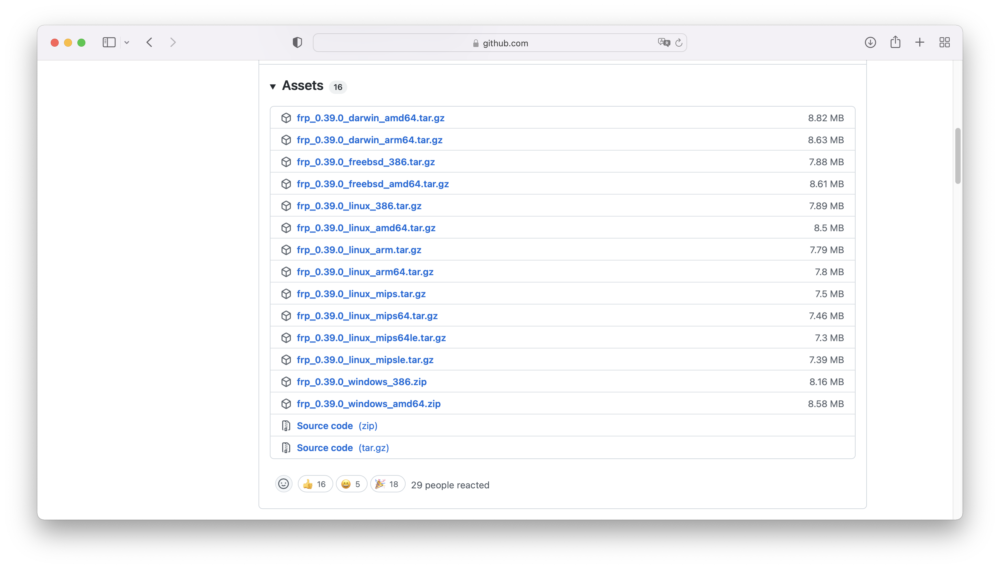
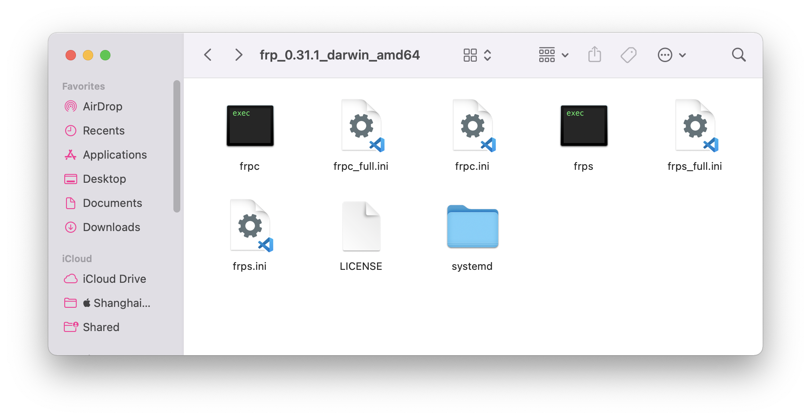

## What is `frp`?

In general, our devices' IP address are local addresses or virtual, and we cannot visit our local devices without using a NAT-penetration tool.

There are some free NAT-penetration tools online (like cpolar), but they are generally unstable. If you have a device with a public IP address (such as a server), you can use 'frp' to penetrate the NAT.

Frp is a reverse proxy which can forward a port of your local server to a public server.

<div class="note note-danger">
<p> <strong>Pre-requisite</strong>: You will need a server with a public IP address, such as a Tencent cloud server.</p>
</div>

## Step1. Download `frp`

`frp` requires the configuration of both the client-side and server-side. First, download `frp` according to your system architecture. In general, a linux server has arch `amd64`, Intel mac has arch `darwin_amd64`, M1-series mac has arch `darwin_arm64`, and arm linux devices including raspberry-pi runs `arm` or `arm64`. 

Frp project address：[https://github.com/fatedier/frp/releases](https://github.com/fatedier/frp/releases)




## Step2. Configure server-side.

Extract what we downloaded, and we can see some files: (The 「s」in 'frps' stands for 'server', and 「c」 stands for 'client')



We need to focus on `frps` and `frps.ini`. 

The public server only requires setting the `bind_port` under the `[common]` tag inside the `frps.ini` file. The value is `7000` by default, which defines that our server will listen for clients from this port.

```ini
[common]
bind_port = 7000
```

<div class="note note-warning">
<p>Remember to allow connections from port `7000` if there's a firewall.</p>
</div>

After that, start the `frps` service by using 
```shell
./frps -c ./frps.ini
```
<div class="note note-success">
<p>You may use `screen` or some other commands to keep `frps` running in the background.</p>
</div>

## Step3. Configure client-side local server.

You need to configure the public server address (IP or domain name), port, and all the local addresses that you want to forward. 

Edit `frpc.ini` file. First, define the server information under the `[common]` flag like:
```ini
[common]
server_addr = 12.34.56.78  # Your server's public IP
server_port = 7000  # Your server's listening port
```

Then, add some services to forward. For instance, if you want to forward localhost ssh port (127.0.0.1:22), then you can use the following code:
```ini
[ssh_myself] 
type = tcp
local_ip = 127.0.0.1
local_port = 22
remote_port = 10000
```
This means that, the name of this service is `ssh_myself` (you can add serveral services in one file, but they cannot share names), and `127.0.0.1` port `22` will be forwarded to the server's `10000` port. You can access local ssh by `ssh user@serverIP -p 10000` through the public Internet.

The same thing can be done to forward a website. For example, if you have deployed a website locally whose local IP is `http://192.168.31.111:8080`, you can use the following to forward it:
```ini
[test]     # 远程连接到内网其它设备指定端口
type = tcp
local_ip = 192.168.31.222
local_port = 8080
remote_port = 10002
```
and then you can use `http://public_ip:10002` to access this website from public internet.

If you want to forward http, consider:
```ini
[web]
type = http
local_port = 8080
local_ip = 127.0.0.1
custom_domains =  # domain name or public IP here
remotr_port=8080
```

After that, start `frpc` service by using 
```shell
./frpc -c ./frpc.ini
```
<div class="note note-success">
<p>Again, you can use `screen` or some other commands to keep `frpc` running in the background.</p>
</div>

After a successful connection between client-side and server-side, both can receive corresponding log messages, indicating the connection is successful.


