# Lecture 1. Introduction

### 6 great ideas in computer architecture

1. **Abstraction** (Layers of Representation / Interpretation)
2. **Moore's Law** (Designing through trends)
3. **Principle of Locality** (Memory hierarchy)
4. **Parallelism**
5. **Performance Measurement & Improvement**
6. **Dependability via Redundancy**


# Lecture 3. C II

**stack**: LIFO (last in, first out) data structure

stack includes: return address; arguments; space for local variables


`strlen()` does not count the `\0` at the end. `sizeof` will do.


```c
void func(){
		char a;          // stack
		static char b;   // static/global
		char c[] = "hi"; // stack
		char *d = "hi";  // static
}
```

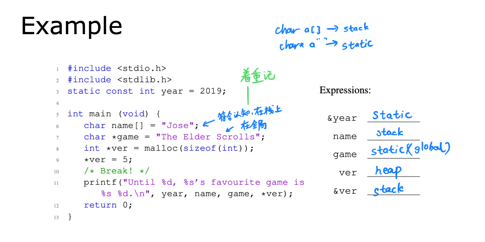


# Lecture 4. Riscv intro

### ISA - Instruction Set architectures

**RISC philosophy:** **Reduced Instruction Set Computing:**

- Keep the instruction set small and simple, making it easier to build fast hardware
- Let software do complicated operations by composing simpler ones


### Mem align

Risc-v does not require that integers be word aligned, but it is very bad if you don't make sure they are. 

Consequences of unaligned integers: slowdown (do unaligned-access in software; lack of atomicity).

So in practice, risc-v requires integers to be aligned on 4-byte boundaries


# Lecture 5. Riscv decision

### Logical instructions

No 'not' operation. Done by `xori -1` (xor with 0xFFFFFFFF)

### 6 fundamental steps in calling a function

1. Put parameters in a place where function can access them
2. Transfer control to function
3. Acquire (local) storage resources needed for function
4. Perform desired task of the function
5. Put result value in a place where calling code can access it and restore any registers you used
6. Return control to point of origin, since a function can be called from several points in a program.

### Unconditional Branches

`jal`  **jump and link** : `PC += imm`, goto that location. The offset is 20 bits, sign-extended and left-shifted one (not two). At the same time, `rd = PC+4`.

`jalr` **jump and link register**


# Lecture 6. Riscv instruction formats


### The "ABI" conventions & Mnemonic Registers

The **Application Binary Interface** defines our 'calling convention' (how to call other functions?)

ABI defines a contract: When you call another function, that function promises not to overwrite certain registers.

**Register conventions**: A set of generally accepted rules as to which registers will be unchanged after a procedure call (`jal`) and which may be changed.


Risc-v function-calling convention devides regs into two categories:

- **Preserved accross function call** (caller can rely on values being unchanged, **callee-saved**)

  `sp`, `gp`, `tp`, `s0-s11` (`s0` is also `fp`)

- **Not preserved across function call** (**caller-saved** registers)

  `a0-a7`, `ra`, `t0-t6`


### Allocating space on stack

- saved return address (if needed)

- saved argument registers (if any) (if more argument)
- saved saved registers (if any) (s0, ...)
- local variables (if any)

### Memory allocation

Stack starts in high memory and grows down 

Stack must be aligned on 16-Byte boundary (not true in examples above)

**text segment** in low end 

**static data segment** (consts and other static variables) above text 

Risc-v convention **`gp` global pointer** points to static 

rv32 gp `0x1000_0000`

**heap** above static for data structures that grow and shrink. Grows up to high addresses.


### Frame pointer `s0`

As a reminder, we shove all the C local variables etc. on the stack, combined with space for all the saved registers. (This is called the 'activation record' or 'call frame' or 'call record').

But a naive compiler may cause the stack pointer to bounce up and down during a function call (a lot simpler to have compiler do bunch of pushes and pops when it needs a bit of temp space). 

Plus, not all programming langs can store all activation records on the stack (e.g lambda, call frames allocated on heap since variables can last beyond the function call)

Therefore, at the start, **save `s0` and then have the Frame Pointer point to one below the sp when you were called**. Then, **address local variables off the `fp` rather than the `sp`**.

simplifies the compiler and debugger.

Note: it isn't necessary in C, and since it's a callee saved reg, it doesn't matter.

(因为不call/return函数的时候也可能需要改变stack pointer, 所以整了一个frame pointer指向栈中元素，取代stack pointer.)


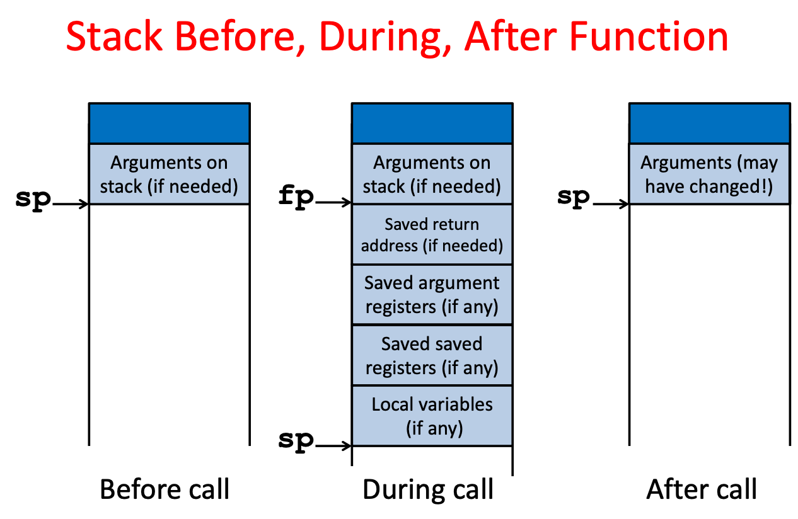

### Instructions

6-basic types of instruction formats

- **R-format** for reg-reg arithmetic operations
- **I-format** for reg-imm arithmetic operations and loads
- **S-format** for stores
- **B-format** for branches (major variant of S, called **SB** before)
- **U-format** for 20-bit upper imm
- **J-format** for jumps(minor variant of U, called **UJ** before)


# Lecture 7. Riscv multi & float

### Floating point representation

SEM / SES / sign, exponent, significand mantissa.

use **'biased exponent'** : want float numbers to be used even if no fp hardware (e.g compare float using integer compares).  2's complement poses a problem

**'biased notation'**: bias is the number subtracted to get final answer.

### **Special numbers**:

| E     | M        | Object       |
| ----- | -------- | ------------ |
| 0     | 0        | 0            |
| 0     | nonzero  | Denorm       |
| 1~254 | anything | +/- fl. pt.  |
| 255   | 0        | $+/- \infty$ |
| 255   | nonzero  | NaN          |


smallest positive normalized number: $2^{-126}$

smallest positive denorm: $2^{-149}$


# Lecture 8. Riscv call


### Interpretation VS Translation 

Interpretation (e.g. Python): slower, programs smaller

Translation: compile and then run, faster, architecture-specified

### Steps in compiling a C program

CALL: compiler, assembler, linker, loader

You write `.c`, compiler produces `.s`, assembler produces `.o`, linker produces `exec`, loader

- **Compiler**: 
  - **lexer** (词法分析, 生成token)
  - **parser** (produces AST)
  - **semantic analysis**(进一步分析是否合法)
  - optimize
  - code generation (can contain pseudo code)
-  **Assembler**: 
  - read and uses **directives** (doesn't produce machine code) `.data, .text, .word, ......`; 
  - **Symbol Table**(list of labels and data that can be referenced across files), 
  - **Relocation Table** (what address does linker need to handle? contains any external label jumped to and data in static section (la))
- **Linker**: put data segment together, text segment together, resolve references

### Static vs Dynamically linked libraries

dynamically linked libraries: link at runtime


# Lecture 9. Synchronous Digital Systems 

**CMOS** (complementary metal-oxide on Semiconductor 互补金属氧化物半导体)


CMOS circuit rules: Don't pass weak values! Use N-type transistors only to pass zero, P only 1.

#### Laws of Boolean algebra


Note the last one ： **$\overline{XY} = \overline{X} + \overline{Y}$**  !!!

#### Type of circuits

SDS consist of 2 basic types of circuits: **CL** (combinational logic) and **SL**(sequential logic)

#### Flip-flop timing 

(Edge-triggered d-type flip flop)


#### Time constraint for SDS

- **Max hold time** = min CL delay + clk-to-q delay  (hold time 不能长于它的input会发生改变的时间，否则不能保持stable)
- **Min clock period** = max CL delay + clk-to-q delay + setup time  （clock需要留一段时间让input发生变化，再留一段时间让input保持stable）


# Lecture 11. Datapath

### Five stages

- **IF** / instruction fetch
- **ID** / Instruction decode: decode, start reading reg, imm
- **EX** / execute, alu
- **MEM** / memory access
- **WB** / Register write


# Lecture 13. Pipelining

**Pipelining**: **higher throughput** at the cost of higher latency

### Pipelined Risc-v datapath

每个stage中间添加寄存器


### Hazards

#### 1. Structural hazard 

Conflict use of a resource.

分为寄存器和内存。寄存器的解决方法是一次可以读两个写一个，内存的解决方法是把IMEM DMEM用cache分开。

- **Regfile structural hazards**: each inst can read 2 reg, write 1 reg, so avoid it by having separate 'ports' (read two, write one simultaneously)

- **Memory**: Imem and Dmem used simutaneously. Solve by caches (2 separate memories). (Without, inst fetch would have to stall)

risc ISA designed to avoid structural hazards (e.g. 1 mem access per inst)

#### 2. Data hazard

分为寄存器和ALU和load delay slot。

寄存器的解决方法是，一个周期先读再写。

ALU的解决方法是forwarding。

load delay slot没办法解决，必须stall一个周期。可以通过reorder code 来缓解。

- **Reg access**: Register access policy: first read then write.
- **ALU result**: 
  - Solution 1: **Stalling**: (compiler can rearange codes or insert NOPs to avoid)
  - Solution 2: **Forwarding**: `if (instM.rd == instX.rs1) use value of ALU instead of Reg`. (Must ignore writes to `x0`).

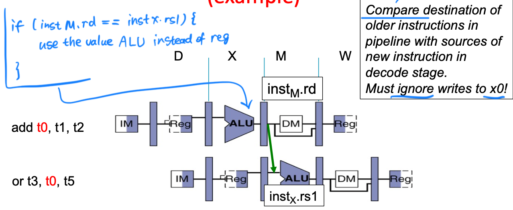

​			Forwarding datapath

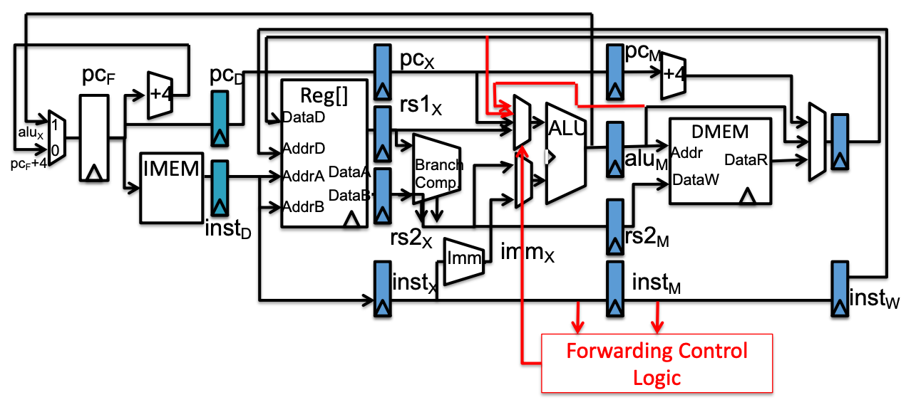

- **Load data hazard**
  - Slot after a load is called **load delay slot**. If 2nd inst uses result of load, must stall for 1 cycle.
  - Solution: put unrelated inst into load delay slot.

#### 3. Control hazard

分支，必须在alu stage之后才能知道结果。要么顺序执行，不对了赶紧kill，要么加上分支预测。

- Execute sequentially (always predict branch not taken)

​		Kill instructions after branch if taken (luckily no state is changed at this time)

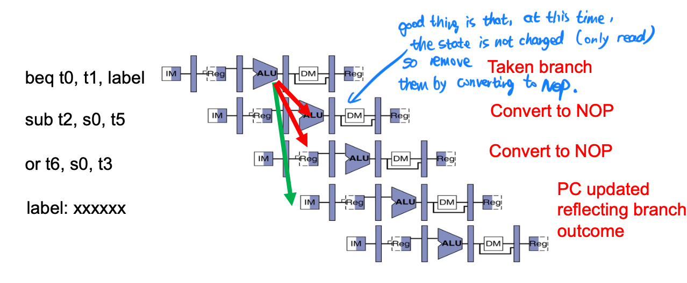

- **Branch prediction**:
  - In IM stage, predict and calculate PC (giving to next clock cycle)
  


# Lecture 14. Superscalar CPUs

> Greater **Instruction-Level Parallelism (ILP)**
>
> - Multiple issue 'superscalar'
>   - Replicate pipeline stages => Multiple pipelines
>   - Start multiple instructions per clock cycle
> - "Out-of-Order" execution
> - Hyper-threading

## ILP (Instruction-level parallelism)


### Hyper-threading 超线程

- Duplicate state-holding elements (PC和寄存器), same CL (mem和ALU仍然只有一个)
- Use **mux** to select which state to use for every clock cycle
- Run 2 independent processes
- No obvious speedup, still one cycle one instruction.


### Superscalar

- In-order issue, out-of-order execute (多个functional units，如ALU和FPU等), in-order commit

- **More than 1 instruction per clock cycle**

- **NOT Multicore**: computing inst from the same program, not different thread! 不是多核，cpu在执行同一个程序！
- SISD (single inst stream, single data stream). However most superscalar processors are also SIMD.


### Iron-Law  (REMEMBER THIS!!!)

$$
\frac{Time}{Program} = \frac{Instruction}{Program} \times CPI \times \frac{Time}{Cycle}
$$

Time the program needs = how many instructions executed * cycles per inst * time per cycle.

#### 计算CPI

- 法1

$$
CPI = \frac{Cycle}{Instruction} = \frac{Time}{Program} \div (\frac{Instruction}{Program} \times \frac{Time}{Cycle})
$$

- 法2

  First calculate the CPI for each individual inst (add, etc).

  Then calculate the frequency of each individual inst.

  Finally multiply them together for each inst and sum (the weighted sum).


### Complex pipeline

- More than 1 Functional Unit
- 浮点
  - Fadd & Fmul：fixed number of cycles > 1; Fdiv: unknown number of cycles
- Issue: assign instruction to functional unit.

#### Modern complex in-order pipeline

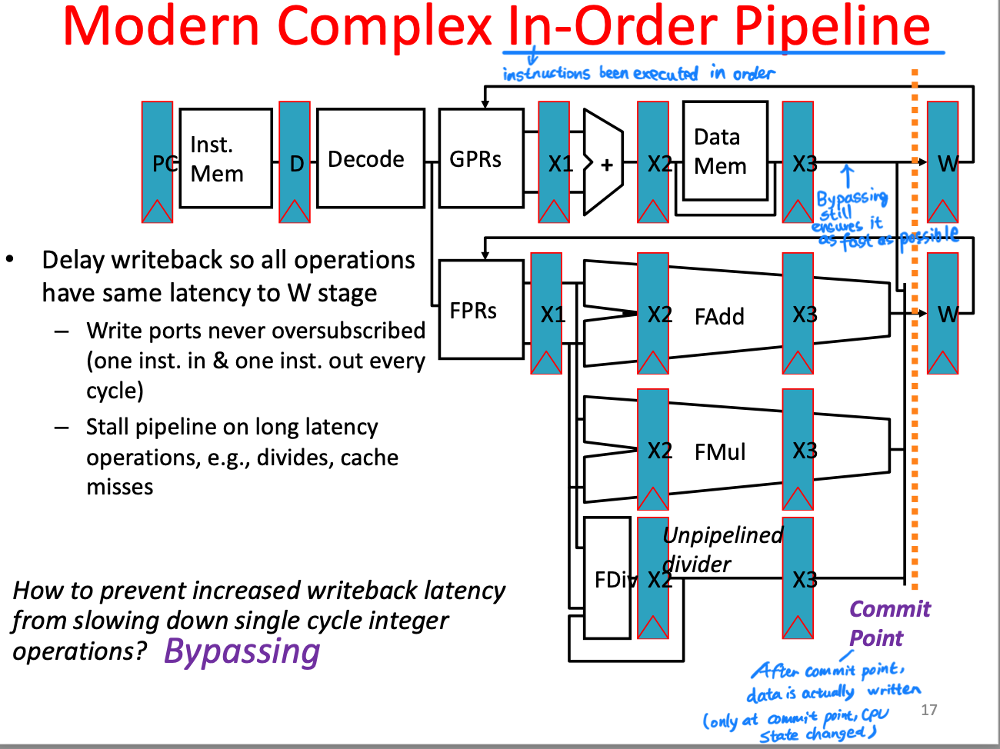


### Static Multiple issue (aka VLIW (very long instruction word) )

一次取出两条指令，如果一条整数/mem，一条浮点，就同时issue。

现代的CPU，4-issue再往上成本就很大了。

Adds more complexity to compiler.


### A question.

hyperthreading CANNOT execute more than 1 process/thread at a given time

superscalar CANNOT execute more than 1 process/thread at a given time

multi-core CAN execute more than 1 process/thread at a given time


### Dynamic Multiple Issues (superscalar)

乱序执行（in-order issue, out-of-order execute, in-order commit）

ROB（Re-order buffer）

Hardware guarantees correctness. Has nothing to do with compiler.


# Lecture 16. Cache I

### Locality 局部性原理

- Temporal Locality 
- Spatial Locality


### Caches

#### Fully-associative

- No set index.  n cache lines, 1 set.
- 1 comparator per line.

#### Direct mapped

- n cache lines, n sets. 

- Only 1 comparator

#### N-way Set-associative

- N places for a line.
- N comparators.

- **T/I/O: Tag / Set Index / Block offset**
- number of sets = number of lines / N
- size of index = log2 (number of sets)
- size of tag = address size - size of index - log2(number of bytes per block)
- **全相联和直接映射是组相联的特例**：Fully associative: N = number of lines;  Direct mapped: N = 1


**associativity** 就是 **number of ways**;  cache line, cache block 是一个意思


**C = N * S * B: ** Total cache capacity = associativity * number of sets * block size (bytes per block)


# Lecture 17. Cache II

### Writing 写操作

#### Write-through policy

- 同时写给cache和memory
- 一般会搞一个write buffer，保证内存速度跟不上时CPU不停止，加快写速度
- 优点：更简单的控制逻辑；冗余两份数据，更安全 (Big idea: Redundancy)

#### Write-back policy

- 只写给cache，每条cache line有dirty bit，只有cache满了才会evict并写入memory
- 优点：reduce write traffic，通常性能更高

#### Write-allocate

- If writing to memory not in the cache, fetch it to the cache line first.

#### No-write allocate

- Just write to memory without a fetch


### Cache replacement policies

TODO!!!!!!!!!!!!!!!!!!!!!!!!!!!!!!!!!!!!!!!!!!!!!!!!!!!!!!!!!!!!!!!!!!!!!!!!!!!!!!!!!!!!!!!!

#### Random

#### LRU (Least-Recently used)

- LRU cache state must be updated on every access

- replace the entry that has not been used for the longest time
- for 2-way cache, need 1 bit for LRU replacement

#### Pseudo LRU

- hardware replacement pointer points to one cache entry 指向可被替换的entry
- whenever access the entry the ptr points to, move to next; otherwise, don't move ptr
- not-most-recently-used


### AMAT (Average memory access time) 平均访存时间

- **Miss Penalty**: time to replace a cache line from lower level in memory hierarchy to cache (包括写回内存 write back的时间)
- **Hit time**: time to access cache memory (包括tag comparision的时间)

AMAT = time for a hit + miss rate * miss penalty


### Ping-pong effect (in direct mapped cache)

- 0 4 0 4 0 4 0 4 互相踢掉对方的例子

- Set-associative can solve it


For a fixed-size cache and fixed block size, associativity increase by 2 ==> number of blocks per set *2, number of sets ÷ 2


### 3C

#### Compulsory miss 

- cold start
- solution: increase block size (but increases miss penalty; too large blocks affect miss rate)
- calculation: set cache size to $\infty$ and fully associative, count # of misses

#### Capacity miss

- Solution: increase cache size (may increase access time)
- calculation: change cache size from $\infty$, usually in powers of 2, and count misses for each reduction in size

#### Conflict miss

- multiple mem locations mapped to the same cache location
- solution 1: increase cache size
- solution 2: increase associativity (may increase access time)
- calculation: change from fully associative to n-way set associative while counting misses


- Suppose you went through the entire string of accesses with a fully associative cache (with an LRU replacement policy), if it hits, conflict miss, otherwise, capacity miss

  假设把整段内存地址使用LRU的fully associative cache全部访问一遍，如果在这个cache里回来的时候hit了，说明是conflict miss，否则说明是capacity miss


# Lecture 18. Cache III


### Victim cache

Have a very small **fully-associative "victim" cache**. When evicting a cache entry, put it in the victim cache.


### Local vs Global miss rate

#### Local miss rate

- The fraction of references to one level of a cache that miss
- **Local miss rate L2 = L2 miss / L1 miss**  ( # of L1 misses = # of L2 accesses )

#### Global miss rate

- The fraction of references that miss in all levels of a multilevel cache
- L2 local miss rate >> global miss rate
- **Global miss rate = L2 miss / Total access = L2 local miss rate * L1 local miss rate**

#### AMAT

- **AMAT = Time for L1 hit + L1 local miss rate * (Time for L2 hit + L2 local miss rate * L2 miss penalty)**


# Lecture 19. DLP

### Parallelism

- Two basic ways: **Multiprogramming** (多程序并发 运行不同任务); **Parallel computing** (运行同一个任务)

#### SISD (single inst single data stream)

Superscalar is SISD because programming model is sequential (even though it can execute several inst in one time, when you program this, you don't care)

#### SIMD (aka hw-level data parallelism)

exploits multiple data streams against a single instruction 多组数据流 同一种操作

#### MIMD

multiple autonomous processors execute different inst on different data


### Amdahl's (Heartbreaking) Law

$$
\text{Speedup} = \frac{1}{(1-F) + \frac{F}{S}}
$$

Suppose enhancement E accelerates a fraction $F < 1$ of the task by a factor $S>1$, and the remainder of the task is unaffected.


### 三个思想

#### 1. 优化瓶颈

#### 2. 合理利用计算资源

#### 3. 对问题拆分，观察是否可以归纳，进行并行操作

​	不要着急用原来的知识做，交给计算机或特定平台使用时可能不高效，换个思路，可以把大问题拆分（先做乘法再做加法）


# Lecture 20. TLP1 & Openmp 


### Threads

- Thread: a sequential flow of instructions 线程就是一个指令流
- Each thread has a PC + reg and access the shared memory (每个线程都有逻辑概念的PC、寄存器和内存)
- Each processor provides one (or more) hardware threads 处理器在硬件层面提供了多个线程
- Operating system multiplexes multiple software threads onto the available hardware threads (操作系统把程序分配到硬件层面的线程，实现调度和分发)


#### Hardware multi-threading (hyperthreading)

HW switch thread to do other works while waiting for cache miss

cost of thread context switch must < cache miss latency

put redundent hardware so don't have to save context (e.g. PC, registers)


### Data Races and Synchroniztion

- Different threads, same memory location, at least one is write ==> **data race**
- Avoid by **synchronizing writing and reading** by **user-level routines that rely on hardware synchronization instructions**  利用硬件支持来手动同步读和写操作

#### Solution1. Read / Write pairs

- **lr** (load reserved) and **sc** (store conditional)
- **`lr rd rs`**:  `rd = mem[rs]`, and add a reservation
- **`sc rd rs1 rs2`**:  `if (reservation valid) { mem[rs1] = rs2; rd = 0; } else {rd = nonzero;}`

- Example: swap

  锁 在内存上（shared memory model）

  ```assembly
          li      t2  1
  try:
          lr      t1  s1 				# t1 = mem[s1]
          bne     t1  x0  try 	
          sc      t0  s1  t2  	# try mem[s1] = 1
          bne     t0  x0  try
  locked:
          # critical section
  unlock:
          sw      x0  0(s1)
  ```


#### Solution2. AMO

- Encoded with R-type instruction format (e.g. **`AMOSWAP`**)

- **`AMOSWAP rd rs2 (rs1)`**: `rd = mem[rs1], mem[rs1] = rs2`

- `aq`(acquire) and `rl`(release) to ensure in-order execution

- Example: 

  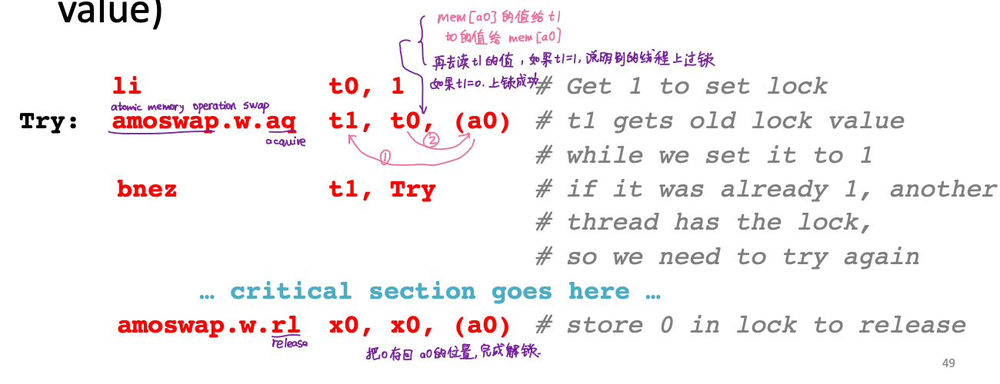

  


# Lecture 22. OS

### What does the OS do?

- loads, runs and manages programs
  - Time-sharing (multiple programs at the same time)
  - Isolation 
  - multiples resources between applications (e.g. devices)
- Services: File system, network, printer...


- As referee (作为裁判): fair sharing of resources among applications （调度进程，分配资源）
- As illusionist (作为幻术师): provide application with "infinite" resources （每个程序都认为自己独占CPU，独占一大整块内存）
- As glue (作为胶水): provide application with standard service interface （与IO设备交互

### OS boot sequence

BIOS --> Bootloader --> OS boot --> Init

UEFI (Unified Extensible Firmware Interface), evolution of BIOS

### Memory mapped I/O (used by RISC-V)

(x86架构使用特殊指令来处理IO，riscv架构使用内存映射IO)

Use normal load/store instructions for input and output. I/O device registers there.

Certain address correspond to registers in I/O devices


# Lecture 23 Virtual memory


## Why do we need virtual memory?

- Adding disks to memory hierarchy
- Simplifying memory for apps (应用程序认为自己独占了一大片内存)
- Protection between processes

**Virtual address space**; **Physical address space**


## Simple base and bound translation

#### Translation

Every process has a base & bound.

Physical addr = logical addr + base register, then OS checks bound, then map to physical memory.

只有CPU处在supervisor mode的时候才能获取base and bound registers，CPU在用户态的时候是不能访问的。

#### Problem: **Memory fragmentation** 碎片化


## Blocks vs Pages

In VM, we deal with individual pages, usually 1 Page ~ 4KB

- The Memory has several **Pages**
- 1 Page has several **Blocks**
- 1 Block has several **Words**

### **Translation**: 

Virtual page number --> Physical page number; offset keeps the same.

Processor-generated addr can be split into **page number** and **offset**

**Page table**: contains the physical addr of the base of each page

Page table makes it possible to store the pages of a program **non-contiguously** (允许不连续存储程序的pages).


Each user has a page table. Page table contains an entry for each user page.

Page tables are in main memory. Need on ref to retrieve the page base addr and another access to the data word  --> doubles the number of memory references

### Linear (simble) page table

#### Page table entry (PTE) contains (一个PTE里面有什么)

- 1 bit to indicate if page exists
- either **PPN (physical page number, for a memory-resident page)** or **DPN(disk page number)**
- **status bits** for protection and usage (R/W/exec 可读?可写?可执行?)

OS sets PT base register(page table的基地址,指向PT开头) whenever active user process changes

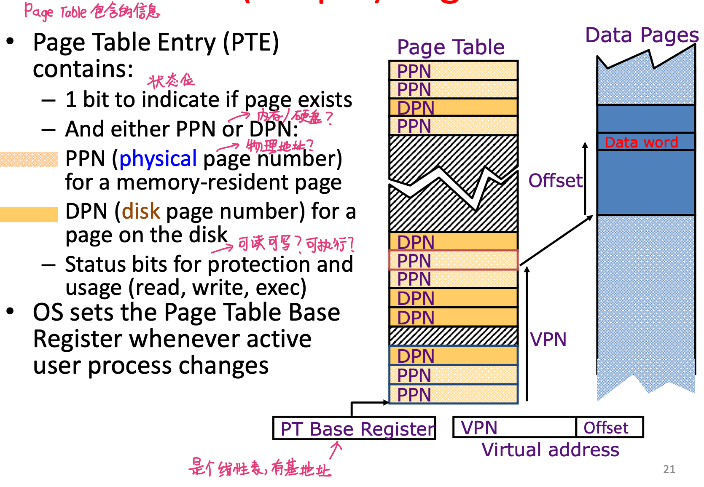

**Page fault**: an inst references a memory page that isn't in DRAM 发现一块虚拟内存对应的是disk page number，在硬盘上。

Page fault handler does the following:

- 如果virtual page不存在(没分配过), 在内存中分配一块
- 如果已经存在(但是在硬盘上), 根据usage选择一块当前在DRAM中的page替换掉
- 被替换掉的page写回到硬盘中，VPN->PPN改成VPN->invalid/DPN
- 现在刚才page fault的地址就有PPN了


### Hierarchical page table 多级页表

多级页表可以更高效地利用内存空间


**Address translation and protection**:

VPN  --> protection check & address translation  -->  PPN


### Translation Lookaside Buffers (TLB)

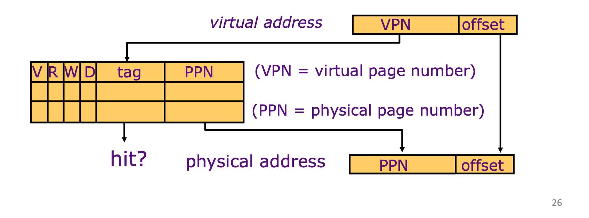

Usually fully associative: each entry maps a large page --> less spacial locality across pages 

**TLB Reach**: size of the largest virtual addr space that can be simultaneously mapped by TLB


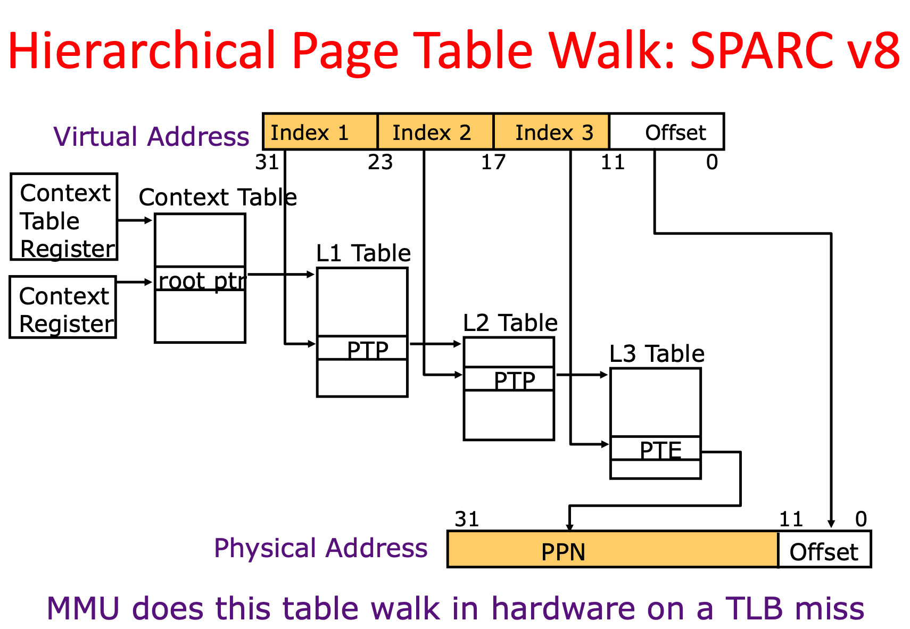


# Lecture 24 FPGA

### Embedded System 

Specifically-functioned; tightly constrained; reactive and real-time; hardware and software coexistance


**Computer-Aided Design (CAD) ** tool 


**ASIC: Application-specific integrated circuits** （专用电路）


### FPGA (Field-programmable gate array)

- Higher performance compared to the conventional CPUs （相比于通用的CPU，性能更高，功耗更低）

- Higher flexibility compared to ASIC （相比于专用电路，更加灵活，因为可以改）


# Lecture 25 WSC, Map reduce and Spark

## Warehouse Scale Computing

### Unique to WSCs

Single machine （一个机房里有很多服务器，但对外呈现出的是一台机器）

Ample parallelism:  request-level parallelism & data-level parallelism

High rate/number of failures

Cost of equipment purchases << cost of ownership 相比于设备本身成本，维护成本大很多

**Scalability可扩展性, energy efficiency, high failure rate**

### WSC storage hierarchy

Lower latency to DRAM in another server than local disk.

Higher bandwidth to local disk than to DRAM in another server


## Request-level Parallelism (RLP)

Implementation startegy: randomly distribute the entries; many copies of data; load balance

- High request volume, each largely independent of other

- use **replication (redundant copies)**: increases opportunities for request-level parallelism; makes the system more tolerant of failures


## Data-level Parallelism (DLP)

SIMD & DLP on WSC (**MapReduce & scalable file systems**)

### MapReduce

- Map: divide large data set into pieces for independent parallel processing
- Reduce: combine and process intermediate results to obtain final result


# Lecture 26. I/O  DMA  Disks  Networking

## Review: I/O

- **Memory mapped IO**: device control / data registers mapped to CPU addr space
- CPU synchronize with IO device (polling; interrupts)
  - **Polling**: lower latency
  - **Interrupt**: higher latency, larger throughput (更适合high volume data transfer)
- **Programmed IO (PIO)**   ==>  **Direct Memory Access (DMA)**

## DMA

Allow IO devices to directly r/w main memory. 

New hardware: **DMA engine**

- CPU initiate transfer, instructs DMA engine that data is available at certain address
- DMA engine handle the transfer (CPU is free to execute other things)
- DMA engine interrupt CPU again to signal completion


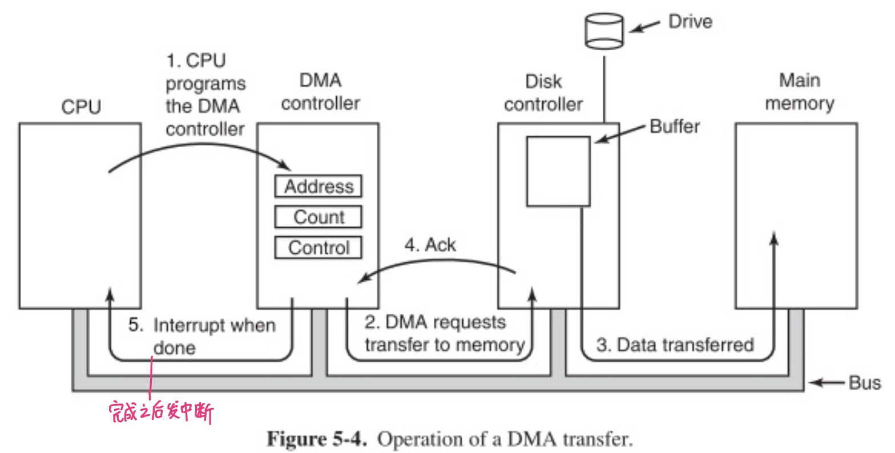


### Problems

Where in the memory hierarchy do we plug in the DMA engine?

- Between CPU and L1 (in cache)
  - Pro: Free coherency
  - Con: 挤占CPU cache的空间
- Between Last-level cache and main memory
  - Pro: Don't mess with caches
  - Con: 需要显式维护上下数据一致性

### Problems

How do we **arbitrate** between CPU and DMA access to memory?

- **Burst mode**: DMA优先

- **Cycle Stealing Mode**: 交替传输

  ​	DMA transfers a byte, releases control, and then repeats/interleaves processor/DMA engine access

- **Transparent Mode**: CPU优先


## Disks

- several platters
- bits recorded in **tracks(磁道)**, divided into **sectors**
- **actuator** moves **head(磁头)** over **track**, wait for sector rotate under head, then read or write


- **Disk access time = seek time + rotation time + transfer time + controller overhead**
  - **seek time**: (number of tracks / 3) * time to move across 1 track
  - **rotation time**: 1/2 time of a rotation


## Networks

Nothing


# Lecture 27. Advanced Cache

## Cache inclusion

- **Inclusive**: L1有的东西L2也有（load时同时load到L1和L2，踢出时只踢L1）
- **Exclusive**: （load时只load到L1，踢出时放到L2）
- **Non-inclusive**


- Inclusive cache eases coherence
  - 高层cache有的东西低层一定也有
  - L2 needs to evict a block, must ask L1 cache if it has the block
- Non-inclusive cache higher performance
  - No back invalidation
  - Larger capacity


# Lecture 28. Dependability and RAID


## Dependability 可靠性

Dependability vs. Redundancy 

- **spatial redundancy**: replicated data or hardware, handle hard and soft(transient) failures （e.g 异地备份）
- **temporal redundancy**: redundancy in time, handle soft(transient) failures (e.g. 丢包，重发)


- Reliability: **MTTF (Mean Time to Failure) 平均出问题的时间**
- Service interruption: **MTTR (Mean Time to Repair) 出问题后平均需要修复的时间**
- **MTBF (Mean Time between Failures)** = MTTF + MTTR
- **Availablity** = MTTF / (MTTF + MTTR)  百分比形式
- **AFR (Annualized Failure Rate)** 平均一年内出问题的比率


## ECC (Error detection/correction codes)

### Parity 奇偶校验

加一个奇偶校验位，原来有8个bit就对这8个bit做异或，把异或的结果放到第9位一起传输 to keep parity even

检查的时候必须是0，如果结果不是0说明出错了

Min Hamming distance of valid parity codes is 2

### Hamming ECC

- Single error correction, double error detection 纠正一位错，检测两位错
- 用更多的parity bits来识别一位错


- 让第1,2,4,8,16,...位的数据当做parity bits，其它数据是普通的data bits
- 每个parity bit检查 bits with least significant bit of address = 1的位置的奇偶性 (set parity bits to create even parity for each group)


### Cyclic redundancy check

Nothing.


## RAID (Redundant arrays of (inexpensive) disks)

### RAID 0: Striping

- striping, or disk spanning 把数据切片写下去
- 不提供 redundancy or fault tolerance
- 高性能

### RAID 1: Disk Mirroring / Shadowing

- 镜像复制
- 提供很高的reliability，但是占用容量、带宽、性能

### RAID 3: Parity Disk

- 按bit写数据
- 如果一块盘挂了，能根据别的硬盘并结合parity恢复出数据
- 仅停留在纸面上

### RAID 4: High I/O Rate Parity

- 把数据按块(block/chunk)写入，并留下一块盘专门写parity
- Works well for small reads, but
- 问题：有一块单独的盘做parity，这块盘可能成为性能瓶颈

### RAID 5: High I/O Rate Interleaved Parity

- 几块盘轮流承担parity的角色，避免一块盘的瓶颈（解决RAID4的问题）


# Lecture 29. Security

## Heartbleed

- Found in TLS heartbeat extension
- happens if the packet's length is not validated
- **implementation flow (not design flow)**

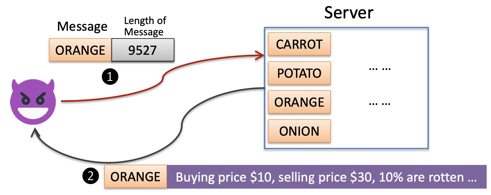


## Eavesdropping disk 用硬盘来监听

- Re-flashing a disk's firmware or maliciously leaving a stealthy backdoor 替换硬盘固件，或者硬盘本身的固件留有后门
- **PES** (Position Error Signal): 位置偏移，能收到pes这个信号并重新将磁头移到正确位置，这个信号能被读出来，转换成音频信号


## RowHammer

不断读写一个内存row without caching

- **Hammered row**
- **Victim row**
- happens because DRAM cells are too close to each other; not electrically isolated (electrical interference)

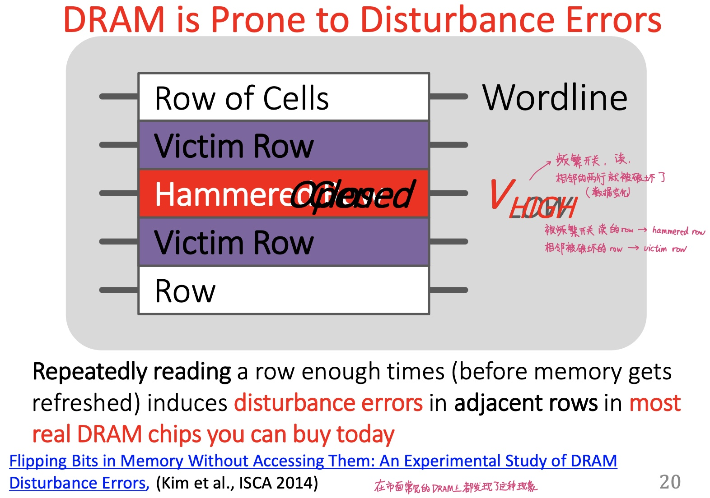

## Side-channel attacks 侧信道攻击

原理是，对于不同的输入，程序会有不同的行为（运算速度、cache使用情况、功耗等），通过分析程序的行为反推出key

- Timing-based attack: 测量程序运行时间（如解密操作的耗时）获得key
- Access-based attack: 测量cache line的hit和miss情况

## Flush + Reload

攻击者flush整条cache line，测量reload的时间获得victim在这段时间内是否访问过cache的情况

## Meltdown

由乱序执行产生，造成了不该有的访存操作，出现“访问痕迹”，通过cache line反推出来

## Spectre

由推断执行产生（如分支预测）


# Lecture 30. Summary

Computer architecture !