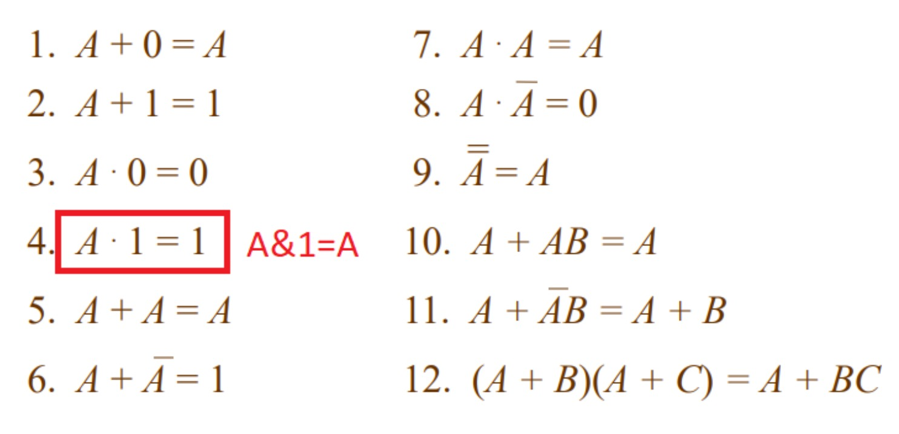

# Topic 1. Intro to digital fundamentals

Asynchronous(异步) / Synchronous(同步) circuits

本课不涉及异步电路, handshaking 非常复杂.


# Topic 2. Number systems, operations and codes


## BCD (binary coded decimal)

- represents **each decimal digit with a 4-bit code**
- commonly used when it's necessary to show decimal numbers like clocks

- 

## Gray code

- **only a single bit change** between one code world
- can avoid problems in where an error may occur when >1 bit changes at a time
- (from right) 1st digit: 0110; 2nd digit: 00111100, ......
- **Race condition (竞争-冒险现象)**


# Topic 3. Logic gates


# Topic 5. Bool algebra & logic simplification

## Boolean Algebra

- **Commutative laws**: $A+B = B+A$  ;  $AB=BA$

- **Associative laws**:  $A+(B+C) = (A+B) + C$  ;  $A(BC) = (AB)C$

- **Distributive law**:  $AB+AC = A(B+C)$

- **Rules of boolean algebra**

  


- **DeMorgan's 1st Theorem**: $\overline{AB} = \overline{A} + \overline{B}$
- **DeMorgan's 2nd Theorem**:  $\overline{A+B} = \overline{A} \cdot \overline{B}$


## SOP & POS

- **SOP (sum-of-products)** 

  In SOP, every variable must appear in each term. (每个变量在每一项中都必须出现)

  e.g. $X(A,B,C) = \overline{A}\cdot \overline{B}\cdot C + \overline{A}\cdot \overline{B}\cdot \overline{C} + ABC$

- **最小项(之和)**

  $m$是乘积项，$n$是变量个数

  对于$n$变量函数，有$2^n$个最小项

  

  性质：

  - 任意输入变量的取值，仅有一个最小项值为1
  
  - 全体最小项之和为1
  
  - 任意两最小项之积为0
  
  - 利用$A+A'=1$，两个**相邻(adjacent)**最小项之和可以合并 
  
    e.g. $ABC'+ABC=AB$

- **最大项(之积)**

  $M$ 是相加项，包含$n$个因子

  对于$n$变量函数，有$2^n$个最大项

  

  性质:

  - 任意输入变量的取值，仅有一个最大项值为1
  - 全体最大项之积为0
  - 任意两最大项之和为1
  - 只有一个变量不同的最大项的乘积等于各相同变量之和


## Karnaugh Maps 卡诺图


### 用卡诺图转 standard SOP

Place a '1' for each minterm 

将每个1写成product形式(e.g. $\overline{A}B\overline{C}$)

### 卡诺图转 non standard SOP

Expand product terms to minterms and place '1' for each minterm

e.g. $\overline{A} + A\overline{B} + AB\overline{C}$

$\overline{A} \rightarrow 000, 001, 010, 011$

$A\overline{B} \rightarrow 100, 101$


### Mapping a standard POS expression

Place a '0' for each maxterm.


## Quine-McCluskey Method 

**Variable**: the input

**Literal**: a variable complemented or uncomplemented

**Implicant**: a product term of literals obtained from K-map such that when implicant = 1, F = 1

**Prime Implicant (PI)**: the implicant that cannot be further simplified

**Essential Prime Implicant (EPI)**: The PI which contain 1's that can only be grouped in this way

**Cover**: a set of prime implicants which covers all 1s


# Chapter 5. Combinational Logic analysis

- **AND-OR** logic

- **AND-OR-Invert** logic

  将 AND-OR 中 0和1反过来, 整体加上一个非

- **NAND-only**

  在 AND-OR 基础上, 加上两层非, 使用 $\overline{A+B} = \overline{A} \cdot \overline{B}$

- **NOR-only**

  在 AOI 基础上, 使用 $\overline{A} \cdot \overline{B} = \overline{A+B} $


加圈代表是low-active


## Combinational logic 组合逻辑

组合逻辑: 任意时刻的输出仅依赖当前时刻的输入


# Chapter 7. VHDL

VHDL: **very high speed integrated circuits hardware description language**

FPGA: **field programmable gate array**


## VHDL language

```vhdl
-- Library and packages header 类似 #include
library IEEE;
use IEEE.STD_LOGIC_1164.ALL;
use IEEE.STD_LOGIC_ARITH.ALL;
use IEEE.STD_LOGIC_UNSIGNED.ALL;

-- Entity: 定义电路的外部特性
entity circuit is 
  Port ( a : in STD_LOGIC;
         b : in STD_LOGIC;
         c : in STD_LOGIC;
       	 f : out STD_LOGIC);
end circuit; 
  
-- Architecture: 设计电路功能
architecture behv1 of circuit1 is
  signal f1: std_logic;
  signal f2: std_logic;

  begin
    f1<=a and b;
    f2<=c and not b;
    f<=f1 or f2;
end behv1;
```


- **Entity**: port mode
  - `<mode>`: IN, OUT, BUFFER(只能一个输入), INOUT (可以由多个source更改)

- **Architecture**: one possible implementation of its associated entity
  - **architecture declarations**: 定义局部的signal, components变量
    - **signal**定义；**component**定义；**constant**定义；**type**定义；**attribute**定义
  - **architecture body**: 定义实现
    - concurrent assignment statements 并行的赋值语句 （WITH SELECT WHEN; WHEN ELSE)
    - component instantiation statements 
    - process statements (sequential 顺序的赋值语句 WAIT IF CASE LOOP)
    - generate statements


- VHDL is **concurrent** 并行结构，改变顺序不影响电路功能

- 多个PROCESS之间是并行的，单个PROCESS里面的语句是顺序执行的，改变顺序会改变功能
- 当PROCESS的sensitivity list中有信号改变时，PROCESS里的语句会被顺序执行


**运算符优先级**（由高到低）

- NOT, abs, ** (指数)
- *乘, /除, mod取模, rem取余
- +, - 正负号
- +, -, & 加减法
- sll, srl, sla, sra, rol, ror 移位
- =, /=, <, <=, >, >= 
- AND, OR, NAND, NOR, XOR, XNOR 逻辑运算符


# Chapter 8. Sequential Circuits 时序电路

## Latches

Latch 能存储1bit的信息

### Basic SR latch

S和R都是 active high 信号

S和R都是1的时候状态不定

可以用两个NOR实现，也可以用两个NAND实现，用NAND实现的时候是active low

### Gated SR latch

Clk=0的时候保持上一状态, Clk=1的时候相当于basic SR latch

可以用AND和NOR，也可以用NAND（NAND更好）

### Gated D latch

Clk=0的时候保持上一状态, Clk=1的时候跟随输入D

```vhdl
-- Gated D latch的VHDL写法
ENTITY latch IS
  PORT (D, Clk: IN  STD_LOGIC;
        Q     : OUT STD_LOGIC);
END latch;
ARCHITECTURE Behavior OF latch IS
BEGIN
  PROCESS(D, clk)  -- 对clk和D都敏感，D发生变化时Q也要变化
  BEGIN 
    IF Clk='1' THEN
      Q <= D;
    END IF;
  END PROCESS;
END Behavior;
```


- level sensitive circuits
  - 当clock为active的时候，output将保持变化，可能会变化多次
  - Gated SR latch, Gated D latch都属于此类，但basic SR latch不属于，因为它没有clk
- level triggered circuit
  - 包括 latch (basic SR latch)


## Flip-flops

### D flip-flop

在active clock edge的时候output跟随input

- Master-slave D flip-flop (使用两个D latch做成)
- Edge triggered D flip-flop

```vhdl
ENTITY flipflop IS
	PORT (D, Clock: IN  STD_LOGIC;
        Q       : OUT STD_LOGIC);
END flipflop;
ARCHITECTURE Behavior OF flipflop IS
BEGIN
  PROCESS(Clock)   -- 仅clock是控制信号，没有D
  BEGIN
    -- 写法1
    IF Clock'EVENT AND Clock='1' THEN
      Q <= D;
    END IF;
      
    -- 写法2
    WAIT UNTIL Clock'EVENT AND Clock='1';
    Q <= D;
  END PROCESS;
END Behavior;
```


### T flip-flop

T=0时保持状态, T=1时反转状态

### JK flip-flop

如果把J和K合二为一，相当于T flip-flop

如果J和K不同时为1，相当于SR-latch (basic SR latch不能输入同时为1)


## Registers

### N-bit register

由N个flip-flop组成，能存储N个bit

### Shift register 移位寄存器

Input is shifted to the right by one bit during each clock cycle

移位寄存器类型

- Serial-in serial-out (SISO)
- Serial-in parallel-out
- Parallel-in serial-out
- Parallel-in parallel-out

## Counters


# Chapter 9. Synchronous sequential Circuits

Sequential circuits 的两种类型

- **Moore**: output仅与state有关
- **Mealy**: output与state和input都有关


State diagram / State table

每个state用一组state variables表示，每个state variable可以用一个flip-flop实现。

One-hot encoding: state的数量与state variable的数量相同


