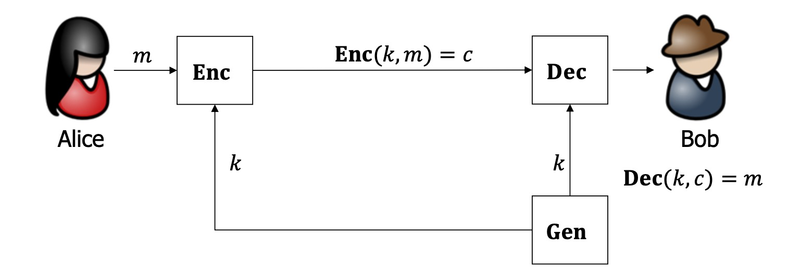
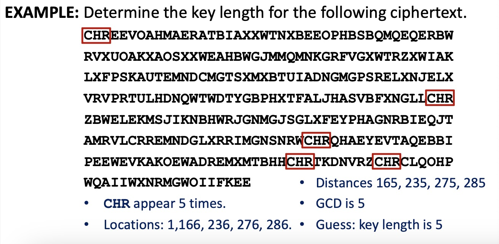

# Lec 1

## Information security

**Information security**: The **protection** of information and information systems from unauthorized access, use, disclosure, disruption, modification, or destruction in order to provide **confidentiality, integrity, and availability**.

- **Confidentiality**: the property that sensitive information is **not disclosed** to **unauthorized** individuals, entities or processes.

- **Integrity**: the property that sensitive data has **not been modified or deleted** in an **unauthorized and undetected** manner. 
- **Authentication**: the process of estabilishing confidence in the identity of users or information systems.
- **Non-Repudiation**: assurance that the sender of information is provided with proof of delivery and the recipient is provided with proof of the sender's identity, so neither can later deny having processed the information.

## Course outline

- classical cryptography
- private-key cryptography
- public-key cryptography
- advanced topics

# Lec 2

## Private-key Encryption (PrivKE)

> - $\mathrm{Gen}$ = key generation, $\mathrm{Enc}$ = encryption, $\mathrm{Dec}$ = decryption
> - $k$ = secret key, $m$ = plaintext (message), $c$ = ciphertext
> - $\mathcal{K}$ = key space, $\mathcal{M}$ = plaintext space, $\mathcal{C}$ = ciphertext space

- $\mathrm{PrivKE} = (\mathrm{Gen, Enc, Dec}) + \mathcal{M}$
  - **Correctness**: $\mathrm{Dec(k, \mathrm{Enc}(k, m)) = m}$
  - **Security**: the adversary should not be able to learn $m$ from $c$

## Kerchkhoff's Principle

**Principle**: The **cipher method must not be required to be secret**, and it must ba able to fall into the hands of the enemy without inconvenience. 加密算法应该公开.

## Shift Cipher

Scheme: $c_i = m_i + k$

**Brute-force attack**: try all possible secret keys 

**Sufficient Key Space Principle**: key space $|\mathcal{K}|$ should be large enough

## Substitution Cipher

Scheme: $c_i = \sigma(m_i)$

- Key space is large for brute-force attack.

- Still not secure! Can be broken by counting the frequencies of individual letters, diagrams, trigrams... 可通过字母频率破解.

## Vigenere Cipher

Scheme: $c_i$ = the letter obtained by shifting $m_i$ forward $k_{(i\  \mathrm{mod}\  t) + 1}$ positions

- Key space is infinite in theory. In addition, same letter in plaintext can be mapped into different letters in ciphertext

- Still not secure! 

  - **Kasiski's method**: two identical segments of plaintext may be encrypted to same ciphertext if their distance is a multiple of key length $t$. 

    Search for pairs of identical segments → record distances → calculate GCD

    

